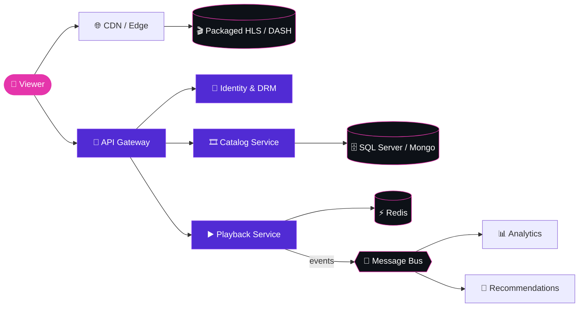

<div align="center">



<br/>

<a href="https://linkedin.com/in/abtin-badiee"></a>
<a href="mailto:abtinbadiee81@gmail.com"></a>
<a href="https://t.me/Abtin_003"></a>
<a href="https://namava.ir"></a>


</div>

<br/>

I'm a **Backend Engineer at [Namava](https://namava.ir)** — one of Iran's largest video-on-demand platforms — where I design and run the **.NET services** behind playback, catalog and user experiences for **millions of viewers**. I care about systems that are fast under load, boring in production and pleasant to work on.

```csharp
public sealed record Engineer
{
    public string   Name      => "Abtin Badiee";
    public string   Role      => "Backend Engineer @ Namava";
    public string   Domain    => "Video-on-Demand · Streaming · High-traffic APIs";

    public string[] Core      => [".NET", "C#", "ASP.NET Core", "EF Core", "Go", "Python"];
    public string[] Data      => ["SQL Server", "PostgreSQL", "MongoDB", "Redis"];
    public string[] Practices => ["Microservices", "Clean Architecture", "CQRS", "Event-Driven"];

    public string   Exploring => "LLM agents & ML-driven recommendations";
    public string   Motto     => "Measure first. Optimize second. Ship always.";
}
```

## ◆ What I build

<table>
<tr>
<td width="50%" valign="top">

**⚡ High-throughput backends**<br/>
<sub>ASP.NET Core microservices, async pipelines and caching layers tuned for peak-hour traffic spikes.</sub>

</td>
<td width="50%" valign="top">

**🎬 Streaming infrastructure**<br/>
<sub>Adaptive bitrate delivery (HLS / DASH), CDN integration and DRM-protected content workflows.</sub>

</td>
</tr>
<tr>
<td width="50%" valign="top">

**🧩 Distributed architecture**<br/>
<sub>Clean Architecture, CQRS and event-driven services that scale teams as well as traffic.</sub>

</td>
<td width="50%" valign="top">

**🧠 Data & intelligence**<br/>
<sub>Real-time viewing analytics and ML-powered recommendations that keep people watching.</sub>

</td>
</tr>
</table>

## ◆ How a play button works — the systems I work on



## ◆ Tech stack

<table>
<tr>
<td align="right"><sub><b>BACKEND</b></sub></td>
<td></td>
</tr>
<tr>
<td align="right"><sub><b>DATA</b></sub></td>
<td> &nbsp;</td>
</tr>
<tr>
<td align="right"><sub><b>INFRA</b></sub></td>
<td></td>
</tr>
<tr>
<td align="right"><sub><b>AI / ML</b></sub></td>
<td> &nbsp;</td>
</tr>
<tr>
<td align="right"><sub><b>FRONTEND</b></sub></td>
<td></td>
</tr>
<tr>
<td align="right"><sub><b>MOBILE</b></sub></td>
<td></td>
</tr>
</table>

## ◆ Engineering focus

| Area | What that means in practice |
|:--|:--|
| **Architecture** | Microservices · Clean Architecture · CQRS · Event-driven design |
| **Streaming** | Adaptive bitrate · CDN integration · DRM · Low-latency playback |
| **Performance** | Multi-level caching · Load balancing · Query & index tuning |
| **Security** | AuthN/AuthZ · Token-based APIs · Encryption at rest & in transit |
| **Delivery** | CI/CD · Containers · Kubernetes · Observability & monitoring |

## ◆ GitHub at a glance

<div align="center">


<br/><br/>

<picture>
  <source media="(prefers-color-scheme: dark)" srcset="https://raw.githubusercontent.com/abtin81badie/abtin81badie/output/github-snake-dark.svg" />
  <source media="(prefers-color-scheme: light)" srcset="https://raw.githubusercontent.com/abtin81badie/abtin81badie/output/github-snake.svg" />
  
</picture>

</div>

---

<div align="center">

<sub>Open to conversations about <b>backend architecture</b>, <b>streaming at scale</b> and <b>.NET</b> — feel free to reach out.</sub>

</div>
